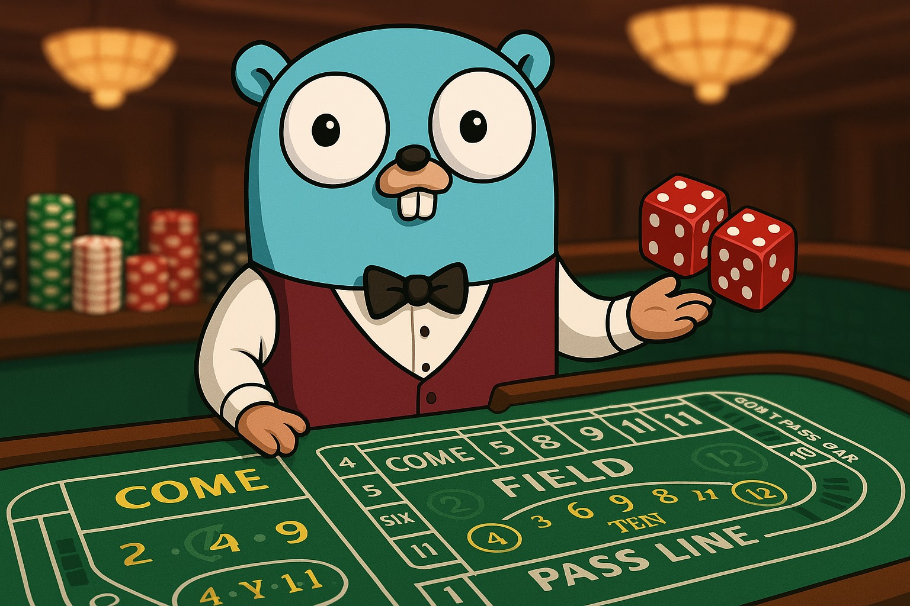
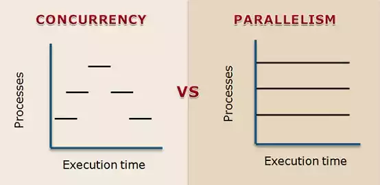
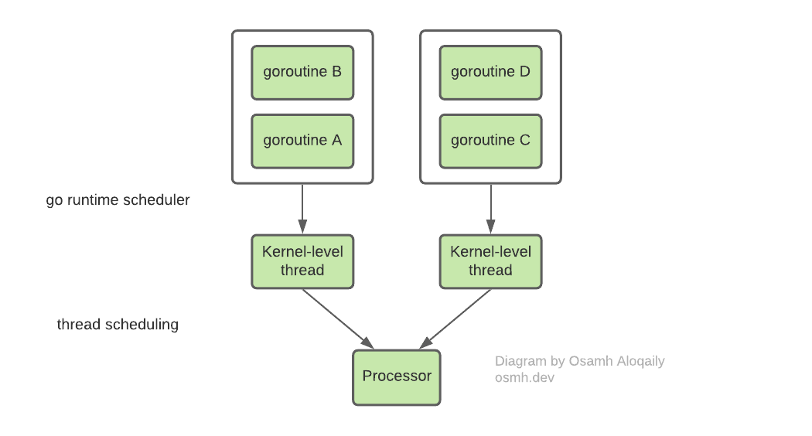

class: center, middle, inverse, small-images
# Go Simple! Go Fast!

### An introduction to Golang and concurrency

<div style="display: flex; justify-content: center; margin-top: 3em; align-items: center; gap: 1em;">

</div>

---

### Your Hosts

<div style="display: flex; justify-content: center; gap: 20px;">
    <div style="text-align: center;">
        
        <p><strong>André Moreira</strong><br>Software Engineer @ VertsaPlay</p>
    </div>
    <div style="text-align: center;">
        
        <p><strong>Eduardo Guedes</strong><br>Software Engineer @ VertsaPlay</p>
    </div>
</div>

<div style="text-align: center; margin-top: 50px;">
    
</div>

<div style="text-align: center; margin-top: 50px;">
    
</div>


---


class: center, middle, inverse

## Don't let this be a monologue

#### Ask questions whenever you want

---
class: middle
### The History of Go

- Created by Robert Griesemer, Rob Pike, and Ken Thompson at Google
- Design began in 2007, first released publicly in 2009
- Became open source with version 1.0 in March 2012

```go
    // A language born out of frustration with existing systems
if (C++ || Java) {
    fmt.Println("Too complex and verbose")
} else if (Python || Ruby) {
    fmt.Println("Dynamic typing and interpreter limitations")
}

```
---
class: middle
### Why Go Was Created

Designed to address software development at Google's scale
Key pain points targeted:

- Slow build times with large codebases
- Unwieldy dependency management
- High complexity in system languages
- Poor support for multicore processing

---
class: middle
### Design Philosophy

- Simplicity as a core value
- Fast compilation and efficient execution
- Built-in concurrency through goroutines and channels
- Strong but pragmatic type system
- Automatic memory management without GC pauses
- Designed for modern networked and multicore computing

---
### Golang 101
- Go is a **procedural programming language**
- It supports **object-oriented concepts** but without inheritance and classes
- It features **strict typing** with some type inference
- Uses **goroutines** for lightweight concurrent execution
- **Channels** for communication between goroutines
- **Interfaces** for implicit type implementation
- **Defer** statements for resource cleanup and management
- **Error handling** with explicit return values instead of exceptions
- **Built-in testing** framework with no external dependencies
- **Go modules** for dependency management
- **Strong conventions** over configuration (e.g., gofmt for formatting)
- **Zero values** for all variables (no uninitialized variables)

---

class: middle

### Go Today

- Powers critical infrastructure worldwide:
    - Docker, Kubernetes, Prometheus
    - Worten, Vertsa Play, Cloudflare, Uber, Twitch
    - Many cloud-native technologies

- Growing ecosystem of libraries and tools
- Major releases approximately every six months
- Continues commitment to backward compatibility

---
class: center, middle, inverse

# Basic Types in Go

---

## Integers (int, uint)
- `int` (signed integers, platform-dependent size)
- `int8`, `int16`, `int32`, `int64` (fixed-size signed integers)
- `uint` (unsigned integers, platform-dependent size)
- `uint8` (alias for `byte`), `uint16`, `uint32`, `uint64` (fixed-size unsigned integers)
- Used for counting, indexing, and mathematical operations
```go
var a int = 42
var b uint = 100
var c int64 = -5000
f := 42 // Another way to more cleanly define a new variable
f := 42 // Does not work since f is already defined
f = 23 // But we can update it!
fmt.Println(a, b, c)
```

---

## Floating Point Numbers

- `float32` (single precision, ~7 decimal digits)
- `float64` (double precision, ~15 decimal digits)
- Used for precise mathematical calculations and measurements

```go
var pi float64 = 3.14159
var temp float32 = 36.6
fmt.Println(pi, temp)
```

---

## Strings
- Immutable sequence of bytes
- Supports UTF-8 encoding
- Can be concatenated using `+`
- Length can be determined using `len()`
- Characters can be accessed as bytes

```go
var name string = "GoLang"
fmt.Println(len(name)) // String length
fmt.Println(name[0]) // Access character (byte)
fmt.Println(name + " is awesome!")
```

---

## Arrays
- Fixed-size collection of elements of the same type
- Cannot be resized after declaration
- Not commonly used

```go
var arr [5]int = [5]int{1, 2, 3, 4, 5}
fmt.Println(arr)
fmt.Println(len(arr)) // Get the length of the array
```

---

## Slices
- Dynamic array with flexible length
- Built-in functions: `append()`, `len()`, `cap()`, `copy()`
- More powerful than arrays as they can grow dynamically

```go
nums := []int{1, 2, 3}
nums = append(nums, 4, 5) // Adding elements
fmt.Println(nums) // [1 2 3 4 5]
fmt.Println(len(nums)) // Length of slice
fmt.Println(cap(nums)) // Capacity of slice
```

---

## Maps
- Key-value pairs (similar to dictionaries/hash tables in other languages)
- Unordered collection of elements
- Dynamic size (can grow and shrink)
- Keys must be comparable types (string, int, etc.)

```go
myMap := map[string]int{"one": 1, "two": 2}
myMap["three"] = 3 // Add new element

value, exists := myMap["key"] // Check if key exists

delete(myMap, "one") // Remove element

fmt.Println(len(myMap)) // Get the length of the map
```

---

## Pointers
- Store memory addresses of variables
- Allow passing references instead of values
- Useful for modifying variables across functions and passing heavy structs
- Zero value is nil

```go
var x int = 10

var p *int = &x // p holds memory address of x

fmt.Println(*p) // Dereferencing - prints 10

*p = 20 // Modify value through pointer

fmt.Println(x) // Prints 20
```

---

##Zero Values in Go

- In Go, all declared variables are automatically initialized with their zero valu
- This ensures no variable is ever undefined, preventing common bugs found in other languages
- Zero values are type-specific and provide a safe starting state
- For composite types, zero values follow a logical pattern (mostly nil)
- This approach eliminates the need for manual initialization in many cases
- Zero values also enable safe operations on uninitialized variables

```go
var i int              // 0
var f float64          // 0.0
var b bool             // false
var s string           // ""
var p *int             // nil
var slice []int        // nil
var m map[string]int   // nil
var c chan int         // nil
```

---

class: center, middle, inverse
# Structs in Go

---

## Basics of Structs
- Custom data types with named fields
- Used to define objects with multiple properties

```go
type UrlResponse struct {
    Url string
    StatusCode uint
    ResponseBody string
    Error string
}
response := UrlResponse{
    Url: "https://example.com",
    StatusCode: 200,
    ResponseBody: "Hello, World!",
    Error: ""
}
fmt.Println(response.Url, response.StatusCode)
```

---

## Ways to Initialize Structs

#### **Field names (most readable)**

```go
response := UrlResponse{
    Url: "https://example.com",
    StatusCode: 200,
    ResponseBody: "Success",
    Error: "",
}
```

#### **Empty initialization with zero values**

```go
var response UrlResponse
// All fields will have their zero values
```

#### **Partial initialization (remaining fields get zero values)**

```go
response := UrlResponse{Url: "https://example.com"}
// StatusCode = 0, ResponseBody = "", Error = ""
```

<!-- ---

## Constructors in Go
- Go does **not** have traditional constructors like other languages.
- A common convention is to use a function named `NewObject` (e.g., `NewUrlResponse`) to initialize and return a new instance of a struct.
- This allows encapsulation and validation before object creation.

```go
type UrlResponse struct {
    Url string
    StatusCode uint
    ResponseBody string
    Error string
}
// NewUrlResponse acts as a constructor function
func NewUrlResponse(url string, statusCode uint) *UrlResponse {
    return &UrlResponse{
        Url: url,
        StatusCode: statusCode,
    }
}
func main() {
    response := NewUrlResponse("https://example.com", 200)
    fmt.Println(response.Url) // Works
    // Other operations with response
}

```

--- -->

---

## Public and Private Fields
- Visibility of fields in Go is determined by their casing:
- **Public**: Fields starting with an uppercase letter are accessible outside the package.
- **Private**: Fields starting with a lowercase letter are only accessible within the same package.
- Private fields promote encapsulation and better struct design.

```go
type UrlResponse struct {
    Url string // Public field
    statusCode uint // Private field
    responseBody string // Private field
    errorResponse string // Private field
}
func main() {
    response := NewUrlResponse("https://example.com", 200, "Success", "")
    fmt.Println(response.Url) // Works
    // fmt.Println(response.responseBody) // Does not works (private field)
    // fmt.Println(response.statusCode) // Does not work (private field)
    // fmt.Println(response.errorResponse) // Does not work (private field)
}
```
---
## Struct Methods
- Fields can be accessed using dot notation
- Supports methods to define behavior

```go
type UrlResponse struct {
    Url string
    StatusCode uint
    ResponseBody string
    Error string
}

func (r *UrlResponse) Info() string {
    return fmt.Sprintf("URL: %s, Status: %d", r.Url, r.StatusCode)
}

response := UrlResponse{Url: "https://api.example.com", StatusCode: 200}

fmt.Println(response.Info())
```
---
## Struct Methods: Pointer receivers

- Beware for pointer receiver!

```go
type UrlResponse struct {
    Url string
    StatusCode uint
    ResponseBody string
    Error string
}

// This will update the instance
func (r *UrlResponse) UpdateStatus(statusCode uint) {
    r.StatusCode = statusCode
}

// This will update a copy the instance which is not returned
// Only useful in cases where you want to guarantee no side effects happen
func (r UrlResponse) UpdateStatusCopy(statusCode uint) {
    r.StatusCode = statusCode
}

func main() {
    response := UrlResponse{StatusCode: 200}
    response.UpdateStatusCopy(404)
    fmt.Println(response.StatusCode) // Still 200
    response.UpdateStatus(404)
    fmt.Println(response.StatusCode) // Now 404
}
```
<!-- ---
## Zero Values in Structs
- Each field in a struct gets initialized to its zero value
- This provides predictable default state for structs

```go
type Person struct {
    Name string
    Age int
    Active bool
    Scores []int
    Metadata map[string]string
}

func main() {
    // All fields initialized with zero values
    var p Person
    
    fmt.Println(p.Name)     // "" (empty string)
    fmt.Println(p.Age)      // 0
    fmt.Println(p.Active)   // false
    fmt.Println(p.Scores)   // nil
    fmt.Println(p.Metadata) // nil
    
    // Accessing a nil slice's length is safe
    fmt.Println(len(p.Scores))     // 0
    
    // Warning: Accessing nil map causes panic
    // fmt.Println(p.Metadata["key"]) // PANIC!
    
    // Always initialize maps before use
    p.Metadata = make(map[string]string)
    p.Metadata["key"] = "value"    // Now safe
}
```

- **Important**: While most zero values are safe to work with, nil maps and nil pointers require special attention to avoid runtime panics

--- -->


---
class: center, middle, inverse

## Golang good practices

#### Keep it stupid simple

---

## Error handing

- You should not ignore errors

```go
config, err := cfg.ReadConfig("config.json")
if err != nil{
    // Logs the error and kills the process
    fmt.Fatalf("Error reading config:",err)
}

user, err := db.FindUser("username")
if err != nil {
    fmt.Println("error reading user", err)
    return err
}

store, err := db.FindStore(user.StoreId)
if err != nil {
    return fmt.Errorf("error finding store: %s", err.Error())
}
```

---

##  Defer

- Runs when the method ends
- Helps the programmer make less mistakes in leaving things open
- Reduces the risk of memory leaks

```go
func ReadConfig(filename string) Config {
    file, err := os.Open("config.json")
    if err != nil{
        fmt.Fatalf("Error reading config:",err)
    }
    defer file.Close()

    // Parsing file logic
}
```

---

## Nested Logic if no error: Wrong! ❌

```go
func (g *Gopher) WriteTo(w io.Writer) (size int64, err error) {
    err = binary.Write(w, binary.LittleEndian, int32(len(g.Name)))
    if err == nil {
        size += 4
        var n int
        n, err = w.Write([]byte(g.Name))
        size += int64(n)
        if err == nil {
            err = binary.Write(w, binary.LittleEndian, int64(g.AgeYears))
            if err == nil {
                size += 4
            }
            return
        }
        return
    }
    return
}
```

---

## Handle errors first: Correct ✅

```go
func (g *Gopher) WriteTo(w io.Writer) (size int64, err error) {
    err = binary.Write(w, binary.LittleEndian, int32(len(g.Name)))
    if err != nil {
        return
    }

    size += 4
    n, err := w.Write([]byte(g.Name))
    size += int64(n)
    if err != nil {
        return
    }

    err = binary.Write(w, binary.LittleEndian, int64(g.AgeYears))
    if err == nil {
        size += 4
    }

    return
}
```


---

class: center, middle, inverse

## Flow control


---

## Loops

```go
// Standard ranged loop
for i := range 30 {
    fmt.Println(i)
}

// While-like loop
sum := 1
for sum < 1000 {
    sum += sum
}

// Infinite loop
for {
    // Do something repeatedly
    if condition {
        break    // Exit the loop
    }
    if otherCondition {
        continue // Skip to next iteration
    }
}

// Iterating over collections
fruits := []string{"apple", "banana", "cherry"}
for i, fruit := range fruits {
    fmt.Printf("Index: %d, Value: %s\n", i, fruit)
}

```

---

## If/Else

Go's conditional statements support initialization:

```go
// Basic if statement
if x > 10 {
    fmt.Println("x is greater than 10")
}

// If/else statement
if score >= 90 {
    fmt.Println("Grade: A")
} else if score >= 80 {
    fmt.Println("Grade: B")
} else {
    fmt.Println("Grade: F")
}

```

---

## Switch Case

Go's switch is more flexible than in other languages:

```go
// Basic switch
switch day {
case "Monday":
    fmt.Println("Start of work week")
case "Friday":
    fmt.Println("End of work week")
case "Saturday", "Sunday": // Multiple cases
    fmt.Println("Weekend")
default:
    fmt.Println("Midweek")
}


// Switch without expression (like if/else)
switch {
case hour < 12:
    fmt.Println("Good morning")
case hour < 17:
    fmt.Println("Good afternoon")
default:
    fmt.Println("Good evening")
}
```

---

class: center, middle, inverse

## Useful commands

---

## Useful Commands

- `go help` - Shows help information for Go commands
- `go version` - Displays the installed Go version
- `go env` - Shows Go environment variables
- `go mod init [module-path]` - Initializes a new module
- `go mod tidy` - Adds missing dependencies and removes unused ones
- `go get [package]` - Downloads and installs packages
- `go list` - Lists packages or modules
- `go doc [package]` - Shows documentation for packages

---

## Running Your Program

```bash
# Run the main package in current directory
go run .

# Run specific file(s)
go run main.go helper.go

```

---

## Testing Your Program

```bash
# Run all tests in current package
go test

# Run tests with verbose output
go test -v

# Run specific test function
go test -run TestMyFunction
```

---

## Building Your Program

```bash
# Build for current platform
go build

# Cross-compile for different OS/architecture
GOOS=linux GOARCH=amd64 go build

# Build to specific output file
go build -o myapp
```

---

## Other Useful Commands

#### Race Conditions Detection

```bash
# Run with race detector
go run -race .

# Test with race detector
go test -race
```
- Identifies data races in your concurrent Go programs
- Should be used during development and testing

#### Benchmark

```bash
# Run benchmarks
go test -bench=.

# Run benchmarks with memory allocation stats
go test -bench=. -benchmem
```

- Measures performance of your code
- Helps identify bottlenecks and optimization opportunities

---


class: center, middle, inverse

## So now I know the basics (kinda)

#### What do I do with this?

---

class: center, middle, inverse

## Mini Project: Part 1

#### Simple URL checker

---

## URL Checker Project

#### Overview

A lightweight utility tool that validates URLs by checking their response status codes and storing the results in a map data structure for easy lookup. This tool reads target URLs from an array and processes them to determine their availability.

#### Features

- Checks HTTP response status codes for a collection of URLs
- Stores results in a map with URL as the key
- Returns both status code and a descriptive message for each URL
- Simple interface for batch URL validation

---

## URL Checker Project

### Technical Specifications

#### Input
- Array of URL strings to validate

#### Output
- Map data structure where:
  - Key: URL string
  - Value: Object containing:
    - `statusCode`: HTTP response status code (e.g., 200, 404, 500)
    - `message`: Description of the result (e.g., "OK", "Not Found", "Server Error")

---

## URL Checker Project

#### Tasks

- Solve it in the main method:
    - Define a map of `string` to `bool`
    - Loop through the URL's
    - Defer the closure of `resp.Body`
    - Do error handling
    - Store true in the map if `200`, false otherwise
    - Print the result map directly
    - Print the result map with `+v` formatting
    - Iterate over the map printing key and value
- Refactor to a method to make it testable
- Run the tests and validate edge case scenarios

---

class: center, middle, inverse

## Concurrency

#### Let's talk about Goroutines

---

## Concurrency?

- Concurrency is everywhere:
    - Mobile apps require background work while maintaining responsive UI
    - Webservers handle thousands of concurrent connections

- **Concurrency**: Dealing with multiple things at once (structure)
- **Parallelism**: Doing multiple things at once (execution)

<div style="text-align: center;">

</div>

<div style="text-align: right; font-size: 0.8em;">
<a href="https://osmh.dev/posts/goroutines-under-the-hood">
 Source
</a>
</div>

---


## Goroutines are not OS threads!
- Goroutines are lightweight "green threads" managed by the Go runtime
- They have a small initial stack size (~2KB) compared to OS threads (~2MB)
- Multiple goroutines share the same OS thread for execution
- The Go runtime scheduler intelligently manages thousands of goroutines across available CPU cores
- Goroutines scale efficiently: you can launch 100,000+ goroutines in a single program with minimal overhead


---

## Goroutine Scheduling
- The Go scheduler employs a cooperative M:N scheduling model
- M goroutines are run in N OS threads (typically matching CPU cores)
- Context switching between goroutines is faster than OS thread switching
- When a goroutine blocks on I/O, the scheduler automatically reassigns the OS thread to other goroutines

<div style="text-align: center;">

</div>

<div style="text-align: right; font-size: 0.8em;">
<a href="https://osmh.dev/posts/goroutines-under-the-hood">
 Source
</a>
</div>

---
class: middle
## How to use goroutines?

- Prefix your methods with go to launch the function as a goroutine
- You can run anonymous functions as goroutines
- Goroutines run concurrently with the rest of your program
- Main program doesn't wait for goroutines to complete

``` go
func main(){    

    // You can run named functions as goroutines prefixing them with go
    go doSomething()

    // Or you can run 1 off anonymous functions
    go func(){
        compute()
    }()
}
```
---
class: middle

## Demo time!

```bash
cd project/examples/concurrency/01_routines
```

#### Run the program Synchronously

``` bash
go run main.go
```

#### Run the program Asynchronously

``` bash
go run main.go -concurrent
```

---
class: middle
### The Problem with Unsynchronized Goroutines

``` go
func main(){    
    
    doSomething()
    
    // The program blocks and waits for doSomething to finish
    fmt.Println("This will only print after doSomething() finishes")
        
    go doSomethingAsync()
    // The program DOESN'T block and continues execution immediately
    fmt.Println("This will likely print BEFORE doSomethingAsync() finishes")
    
    // Without proper synchronization, the program might exit
    // before goroutines complete their work
}
```

---
class: center, middle
## So how do we Synchronize goroutines?
---
class: middle

## By using waitgroups

- A WaitGroup is a counter that helps coordinate multiple goroutines
- Use Add(n) to increment the counter before starting goroutines
- Each goroutine calls Done() when it completes its work
- The main goroutine uses Wait() to block until all goroutines finish


```go
func main() {
    // We define a waitgroup from the sync package
    var wg sync.Waitgroup

    // Increment counter before launching the goroutine
    wg.Add(1)
    go func(){
        // Use defer to ensure Done() is always called when the function eturns
        defer wg.Done()
        doSomething()
    }
    
    // Wait blocks until the WaitGroup counter reaches zero
    // If Done() is never called, this will block forever (deadlock)

    wg.Wait()
    fmt.Println("All goroutines completed!")
    
}
```
---
class: middle

## Demo time!

```bash
cd project/examples/concurrency/02_waitgroups
```

#### Run the program without synchronization

``` bash
go run main.go
```

#### Run the program with Waitgroups Synchronization

``` bash
go run main.go -wg
```

---
class: middle, center
## Concurrency biggest problem?

A programmer had a problem. He thought to himself, "I know, l'll solve it with threads!". has Now problems. two he

-r/ProgrammerHumor

---
class: middle
## The problem with race conditions

- Race condition: When multiple goroutines access shared data and at least one modifies it
- The final result depends on the precise timing of operations
- Creates unpredictable behavior that's difficult to debug
- Can't be reliably reproduced or tested

```go
func main(){
    count := 0

    // This is NOT thread-safe
    for range := 10 {

        go func() {
            // Multiple goroutines might read the same value
            // before any of them have a chance to write back
            count++ // Reading and writing without synchronization
        }()

    }
}
```

---
class: center, middle

### Don't communicate by sharing memory, share memory by communicating

-Rob Pike, one of the co-creators of Go.

---
class: middle

### Channels: Communication as Synchronization

- Channels are typed conduits for sending and receiving values between goroutines
- They handle both data transfer and synchronization
- Designed to avoid race conditions through message passing
- Make concurrent programming safer and more predictable

<div style="text-align: right; font-size: 0.8em;">
<a href="https://divan.dev/posts/go_concurrency_visualize/">
 Vizualizing concurrency
</a>
</div>

---

class: middle
### Channels: Communication as Synchronization

- The arrow (<-) syntax indicates the direction of data flow
- Sending to a channel: channel <- value
- Receiving from a channel: value := <-channel

``` go
func main(){
    // Create an unbuffered channel
    ch := make(chan int)

    // Send a value (blocks until someone receives)
    go func() { 
        ch <- 42 
    }()

    // Receive a value (blocks until someone sends)
    value := <-ch
    fmt.Println(value)  // Prints: 42

}
```
---

## Unbuffered Channels

- Created with ch := make(chan int) - no capacity specified
- Provide synchronous communication between goroutines
- Sender blocks until a receiver takes the value
- Receiver blocks until a sender provides a value
- Act as both data transfer and synchronization mechanism

```go
go func() { ch <- 42 }()    // Sender blocks until someone receives
go func() { ch <- 12345 }() // Another sender also blocks
value := <-ch               // Receives one value (either 42 or 12345)
<-ch                        // Receives the other value
```
---

class: middle
## Unbuffered Channels
- Safe for coordination between multiple goroutines

```go
func main(){
    ch := make(chan int)

    // Producer sends exactly one value
    go func() {
        ch <- 42 // This goroutine will block until one worker receives
    }()
    
    // Only one worker will receive the value
    go func() { // Worker 1
        value := <-ch // Might receive the value
        fmt.Println("Worker 1 got:", value)
    }()
    
    go func() { // Worker 2
        value := <-ch // Or this worker might receive the value
        fmt.Println("Worker 2 got:", value)
    }()
}

```

---

## Buffered Channels

- Created with `ch := make(chan int, capacity)` - specify buffer size
- Provide asynchronous communication up to buffer capacity
- Sender only blocks when the buffer is full
- Receiver blocks only when the buffer is empty
- Allow for temporary mismatch between send and receive operations
```go
ch := make(chan int, 2) // Channel with buffer capacity of 2
ch <- 1                 // Doesn't block (buffer has space)
ch <- 2                 // Doesn't block (buffer still has space)
ch <- 3                 // Blocks until someone reads and makes space
```

- Useful for:
    -  Batch processing without forcing immediate consumption
    - Handling bursts of data with predictable upper limits
    - Decoupling producers and consumers when timing isn't critical

---

## Using select

Select can be used for multiple channel operations:

- Works like a switch statement but for channel operations
- Allows waiting on multiple channel operations simultaneously
- Blocks until one of the cases can proceed
- If multiple cases are ready, one is chosen randomly
- Non-blocking operations possible with `default` case

```go
select {

    case msg1 := <-channel1:
    fmt.Println("Received from channel 1:", msg1)

    case msg2 := <-channel2:
    fmt.Println("Received from channel 2:", msg2)

    // Without default case the select if a blocking operation
    // it will block until one of the channels is filled
    default:
    fmt.Println("This will run and finish the select statement")
}

```
---

## Avoiding Deadlocks
- Always provide a way to exit goroutine loops
- Close channels when done with them
- Use "done" channels to signal completion
- Consider context.Context for timeout/cancellation

```go
func worker(done <-chan struct{}, work <-chan int) {
    for {
        select {
        case <-done:
            return  // Exit cleanly when signaled
        case task, ok := <-work:
            if !ok {
                return  // Channel closed, exit gracefully
            }
            process(task)
        }
    }
}
// Usage
done := make(chan struct{})
work := make(chan int)
go worker(done, work)

// Signal termination
close(done)  // All receivers will get the zero value
```
---

class: middle
## Demo time!
```bash
cd project/examples/concurrency/03_channels
```
Run the program with race conditions
``` bash
go run main.go
```
Run the program with channels
```bash
go run main.go -chan
```

---

class: middle

## Channels vs. Traditional Synchronization (Mutexes)

- Channels: Best for communicating between goroutines
    - Simple data passing and signaling
    - When control flow is tied to data flow
    - Complex coordination patterns (workers, pipelines)

- Mutex: Best for protecting shared state
    - Simpler for read/write access to shared data
    - More efficient for frequent, brief operations
    - When performance is critical for simple shared resources

---
class: middle

## Using mutexes

```go 
func main(){
    // Protecting shared state with a mutex
    var mu sync.Mutex
    count := 0

    for range := 10{
        // Safe increment with mutex
        go func(){
            // Lock the mutex before accessing the data

            mu.Lock()
            count++
            mu.Unlock() // always unlock or you will cause a deadlock

            // A common best pratice is to always defer the Unlock
        }
    }

}

```

---
class: middle
## Demo time!

```bash
cd project/examples/concurrency/04_mutexes
```
Run the program using channels for cache
```bash
go run main.go
```
Run the program using mutex for cache

```bash
go run main.go -mutex
```


---

class: center, middle, inverse

## Hands-on: Mini Project 2
#### Time to apply what you learned!

---
class: middle

### Problem: Check if multiple websites are available

- Sequential approach is inefficient
- Each request must wait for the previous one to complete
- Total time = sum of all individual request times

```go
// Sequential approach
func iterateOverUrlSync(urls []string) map[string]bool {
    
    result := make(map[string]bool)

    for _, url := range urls {
        resp, err := http.Get(url)
        // Check response and update result
        result[url] = resp.StatusCode == 200
    }

    return result
}
```
---

class: middle
## Project Tasks

#### Implement iterateOverUrlAsync function that:

- Uses goroutines to make HTTP requests concurrently
- Uses WaitGroup to wait for all requests to complete
- Uses mutex to safely update the shared result map
- Times individual requests and total execution time


- Modify main() to use your async implementation
- (Bonus) Create an alternative implementation using channels instead of mutex

```bash
cd project/mini_project_2

# Implement your solution, then run:
go run main.go
```

---
class: middle

##Expected Result

- Concurrent execution should be significantly faster
- Total time ≈ time of the slowest request (not the sum)
- All URLs should be properly checked and results stored

---

class: middle

####Using Mutexes 

```go
govar mu sync.Mutex  // Protects the shared map
go func(url string) {
    defer wg.Done()
    // Make HTTP request
    mu.Lock()
    result[url] = resp.StatusCode == 200
    mu.Unlock()
}(url)

```

####Using Channels (bonus):

```go
type urlResult struct {
    url    string
    status bool
}
resultCh := make(chan urlResult)

go func(url string) {
    // Make HTTP request
    result := urlResult{
        url: url,
        status: resp.StatusCode == 200
    }
    resultCh <- result
}(url)

result := make(map[string]bool)
for res := range resultCh {
    result[res.url] = res.status
}
```

---

## Other amazing topics worth looking into

- Modules
- [https://go.dev/talks/2014/gotham-context.slide#1](Contexts)
- Struct composition
- Interfaces
- Reflection

---

## Useful links

- https://go.dev/talks/2013/bestpractices.slide
- https://divan.dev/posts/go_concurrency_visualize/


--- 
